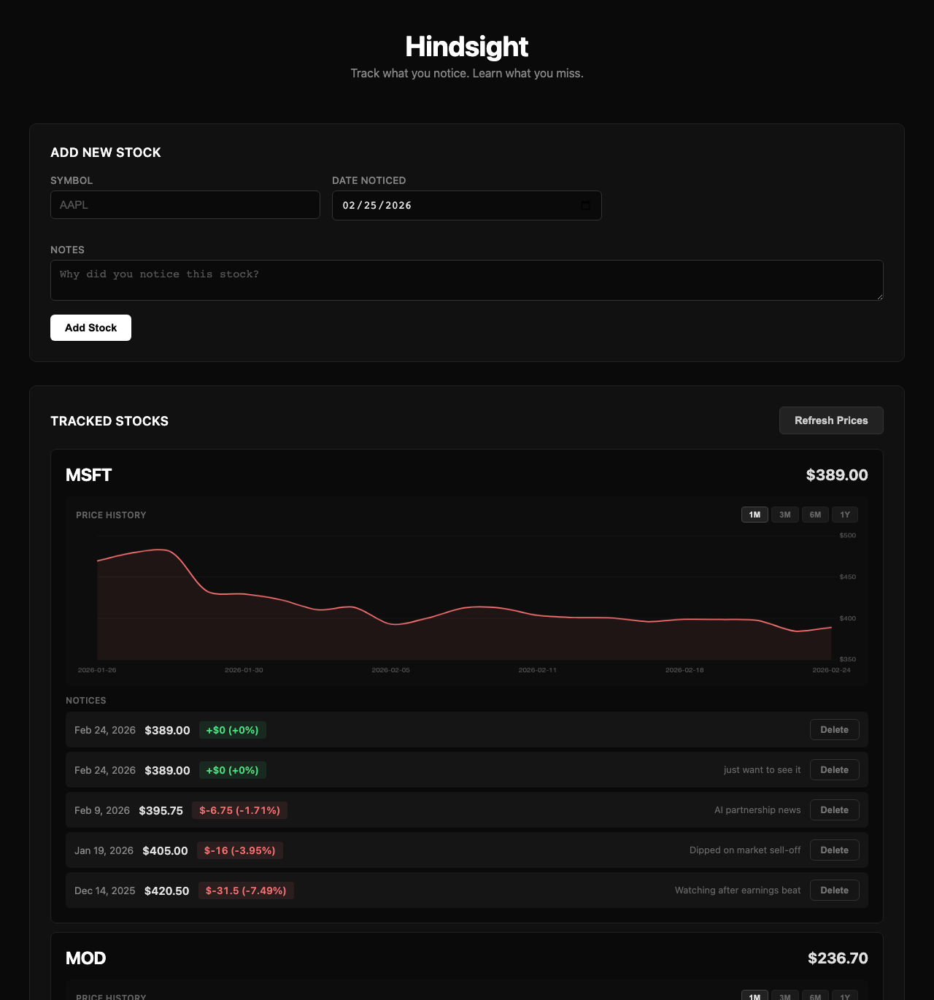

# Stock Tracker



You know the feeling. You see a stock, something catches your eye — maybe it's in the news, maybe a friend mentioned it, maybe the chart just looks interesting. You think about buying but you don't pull the trigger. A week goes by. A month. Three months. And then you're left wondering: *what was the price when I first noticed it? How much would I be up right now?*

This app is for that exact feeling. Log the stocks you notice with the date and price, and watch what happens. No portfolio to manage, no money on the line — just a simple record of "I saw this at $X on this date" and a clear view of how it's moved since.

## What It Does

- **Log what you notice** — ticker, date, price, and a note about why it caught your eye
- **See what happened** — current price and change since you noticed it (in $ and %)
- **Historical context** — prices from 1 day, 1 week, 1 month, and 3 months ago
- **Auto-fetch prices** — hit "Fetch Current Price" to fill in today's price when logging

## Quick Start

```bash
cd stock-tracker
pip install -r requirements.txt
python backend/app.py
```

Open http://localhost:5001 in your browser.

## Tech Stack

Flask + SQLite + vanilla JS. Stock data from Yahoo Finance via [yfinance](https://github.com/ranaroussi/yfinance). No API keys needed.
